  
  
  

---

### 🧑‍💻 About me

- 🎓 **MSc student in Computer Science**
- 🛠️ I build things across the stack — from **low-level C/C++ systems** to **microservices on Kubernetes**
- 🔐 Into **networking, security, and reverse engineering**
- 🤖 Playing with **AI agent orchestration** and multi-agent systems
- 👨‍🏫 I teach — I write full **Hebrew-language courses** on Python, SQL, Full Stack, networking and ethical hacking
- 📫 Reach me on [**LinkedIn**](https://www.linkedin.com/in/ahmad-kais-6a0384214/) or at **ahmadqais1997@gmail.com**

---

### 🧰 Tech stack

 

 

---

### 🚀 Featured projects

 

---

### 📊 GitHub stats

---

### 🐋 Deep dive into my contributions

